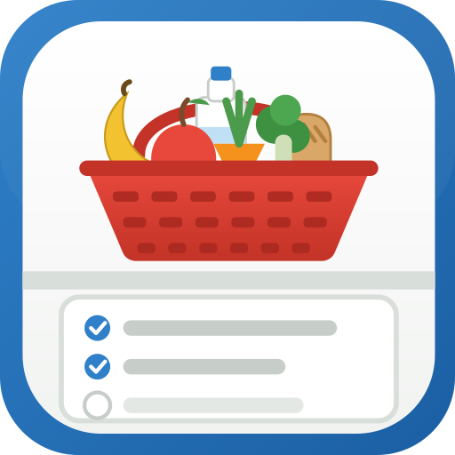
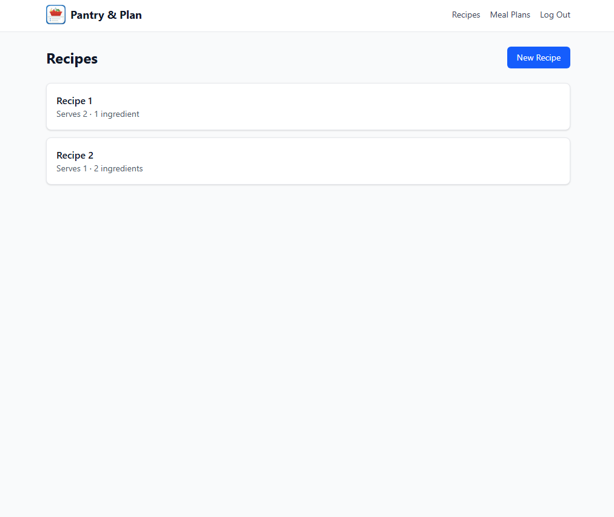
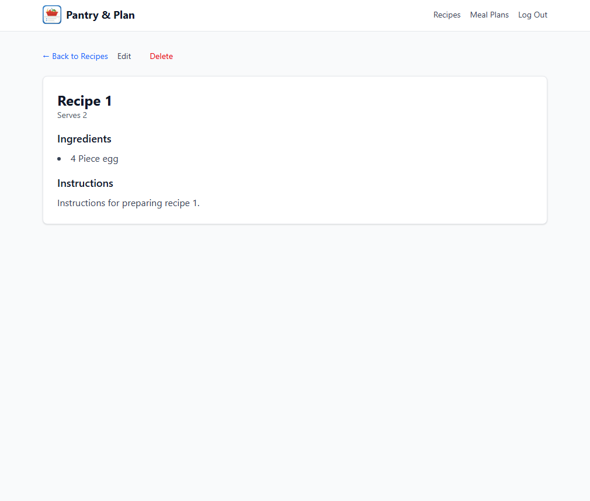
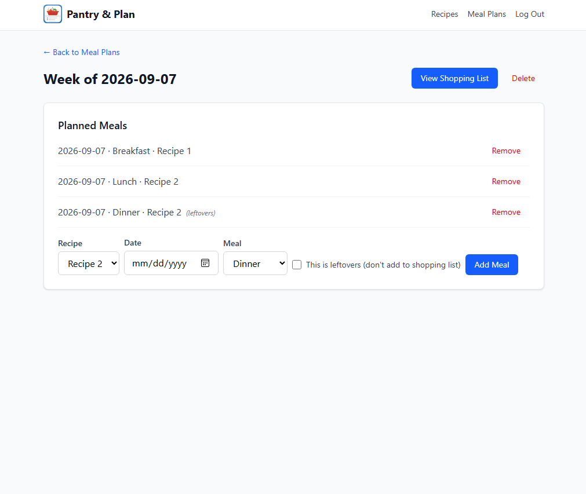
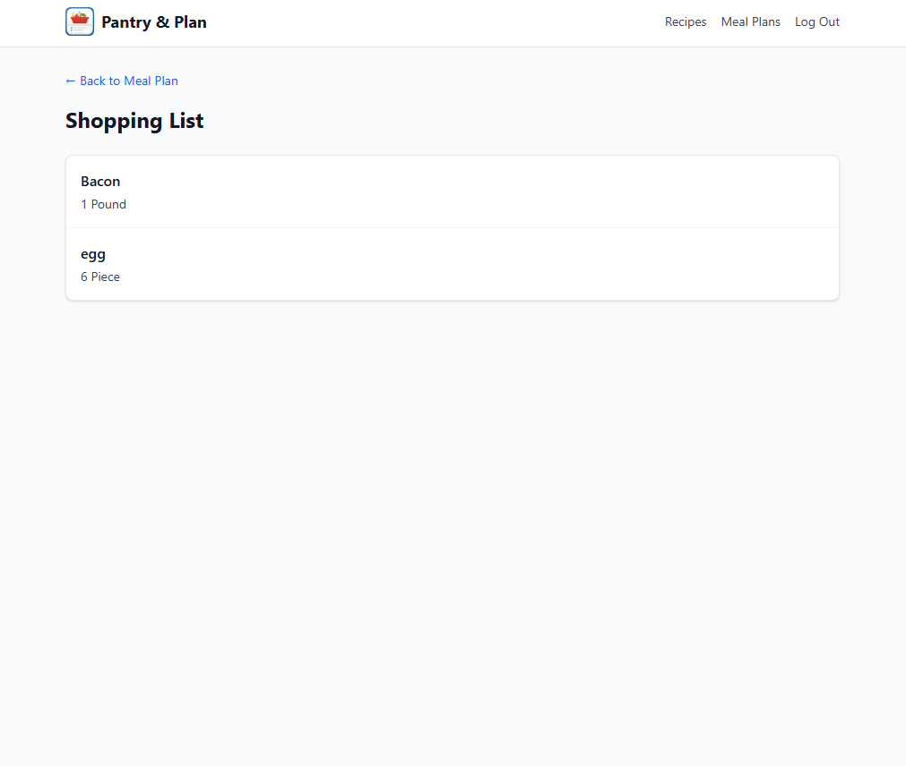

#  Pantry & Plan

[](https://github.com/Zendrakk/pantry-plan/actions/workflows/ci.yml)


A full-stack recipe and meal-planning application. Users manage a personal recipe collection, plan meals across a week, and get an automatically generated shopping list that intelligently combines ingredients across every planned recipe — while correctly excluding meals marked as leftovers.

Built end-to-end as a portfolio project: ASP.NET Core Web API backend, React + TypeScript frontend, PostgreSQL database, with a full automated test suite and CI/CD pipeline.

## Live Demo

- **App**: [pantryandplan.com](https://pantryandplan.com)
- **API**: [pantry-plan-api-fhbbdwc5grbpczbv.centralus-01.azurewebsites.net](https://pantry-plan-api-fhbbdwc5grbpczbv.centralus-01.azurewebsites.net)

Deployed across three separate providers — a deliberate choice, using the best free-tier fit for each piece rather than defaulting to one vendor:
- **Frontend**: [Cloudflare Pages](https://pages.cloudflare.com), auto-deploying on every push to `main`, served on a custom domain registered through Cloudflare
- **Backend**: [Azure App Service](https://azure.microsoft.com/products/app-service) (free tier), via a GitHub Actions CI/CD pipeline
- **Database**: [Neon](https://neon.tech) (serverless Postgres, free tier)

Note: the backend runs on Azure's free tier, which sleeps after inactivity — the first request after idle time may take up to 30 seconds while it "cold starts."

## Screenshots

| Recipe List | Recipe Detail |
|---|---|
|  |  |

| Meal Plan | Shopping List |
|---|---|
|  |  |

## Features

- **Authentication** — registration, login, and logout with industry-standard JWT access tokens and secure, HttpOnly refresh token cookies
- **Refresh token rotation with theft detection** — every refresh issues a new token and revokes the old one; if a previously-rotated token is ever replayed, every active session for that user is automatically revoked as a precaution
- **Brute-force protection** — IP-based rate limiting and account lockout on the login endpoint, deliberately tuned to avoid becoming a denial-of-service vector against real users
- **Recipe management** — full CRUD with server- and client-side validation, ingredient deduplication, and ownership-scoped access (users can only ever see or modify their own data)
- **Meal planning** — plan recipes across specific dates and meal types, with support for marking a planned meal as "leftovers" so it doesn't duplicate ingredients on the shopping list
- **Automatic shopping list generation** — aggregates ingredients across every non-leftover recipe in a meal plan, merging quantities that share a unit and keeping mismatched units as separate line items
- **Polished UI** — toast notifications, custom confirmation modals, loading states, custom branding, and a consistent component library — no native browser dialogs

## Tech Stack

**Backend**
- ASP.NET Core (.NET 10) Web API, controller/service architecture with interfaces for testability
- Entity Framework Core, code-first migrations, PostgreSQL (hosted on [Neon](https://neon.tech))
- ASP.NET Core Identity for user management and password hashing
- JWT Bearer authentication with custom refresh token rotation

**Frontend**
- React 19 + TypeScript, built with Vite
- Tailwind CSS
- React Router with layered route guards (protected routes, guest-only routes)
- React Context for auth, toast, and confirmation-modal state

**Testing & CI/CD**
- xUnit + EF Core InMemory provider (backend), Vitest + React Testing Library (frontend)
- 51 backend tests, 25 frontend tests
- GitHub Actions running both suites in parallel on every push
- Deployed via CI/CD: GitHub Actions auto-deploys the backend to Azure; Cloudflare Pages auto-deploys the frontend, both triggered on every push to `main`

## Architecture Highlights

A few deliberate decisions worth noting:

- **404, not 403, for resources you don't own.** Every query for a recipe or meal plan filters by owner at the database level, so requesting another user's resource returns "not found" rather than "forbidden" — this avoids confirming to an attacker that a given resource ID even exists.
- **`ProblemDetails` extensions for structured errors.** When a recipe deletion is blocked because it's referenced by a meal plan, the API returns a standard RFC 7807 `ProblemDetails` response with the list of conflicting meal plans attached as an extension — not a custom, one-off error shape.
- **Sorting and validation live in the service layer, not the client.** Meal plan entries are sorted chronologically (then by meal type) and recipes are sorted alphabetically entirely on the backend, so every consumer of the API gets correct, consistent ordering for free.
- **The access token lives in memory only.** It's never written to `localStorage` or `sessionStorage`, reducing exposure to token theft via XSS. Session continuity across page reloads is handled by silently refreshing via the HttpOnly cookie on app load.
- **Ingredients are scoped per-user, not shared globally.** Two users can each have their own "Flour" ingredient row — this prevents a user from ever seeing free-text content (like an ingredient name) that another user created, closing off a potential vector for inappropriate or abusive content to become visible across accounts.
- **Targeted, structured logging around security-sensitive events.** Rather than logging every request, `AuthService` logs specifically at meaningful points — failed login attempts, account lockouts, successful registrations, and especially refresh token reuse detection (logged at `Error` severity, since it signals a possible token theft attempt) — using structured log parameters rather than string interpolation, so fields like user ID remain queryable in tools like Azure's Log Analytics.

## Known Limitations & Possible Future Work

- The shopping list does not attempt unit conversion (e.g., cups to grams) — ingredients measured in different units are listed as separate line items rather than converted and merged. This was a deliberate scope decision, since unit conversion depends on ingredient density and is a meaningfully harder problem.
- Leftover tracking is a simple boolean per meal plan entry rather than full portion/serving tracking — it assumes a leftover entry fully reuses a prior entry's ingredients rather than modeling partial consumption.
- No end-to-end (browser-driven) test suite; the project relies on thorough manual verification plus focused backend service tests and frontend component tests.
- The backend is hosted on Azure App Service's free (F1) tier, which sleeps after a period of inactivity. The first request after a period of idle time (or right after a fresh deploy) may take longer than usual while the app "cold starts" — subsequent requests are fast. A paid tier would eliminate this, but wasn't necessary for a portfolio project's needs.

Want to try it without setting anything up? See the [Live Demo](#live-demo) above. To run it locally instead, follow the steps below.

## Getting Started

### Prerequisites

- [.NET 10 SDK](https://dotnet.microsoft.com/download/dotnet/10.0)
- [Node.js](https://nodejs.org) (LTS)
- A PostgreSQL database (e.g. a free [Neon](https://neon.tech) instance)

### Backend setup

```bash
cd server
dotnet user-secrets init
dotnet user-secrets set "ConnectionStrings:DefaultConnection" "<your-postgres-connection-string>"
dotnet user-secrets set "Jwt:SigningKey" "<a-long-random-string>"
dotnet user-secrets set "Jwt:Issuer" "PantryPlanApi"
dotnet user-secrets set "Jwt:Audience" "PantryPlanClient"
dotnet ef database update
dotnet run --launch-profile https
```

The API will be available at `https://localhost:7126`.

### Frontend setup

```bash
cd client
npm install
npm run dev
```

The app will be available at `http://localhost:5173`, proxying API requests to the backend automatically.

## Running Tests

**Backend**
```bash
cd server
dotnet test
```

**Frontend**
```bash
cd client
npm run test -- --run
```

Both suites also run automatically in CI on every push via GitHub Actions.

## Project Structure

```
pantry-plan/
├── server/              # ASP.NET Core Web API
│   ├── Controllers/
│   ├── Services/
│   ├── Domain/
│   ├── Models/
│   └── Infrastructure/
├── client/               # React + TypeScript frontend
│   └── src/
│       ├── pages/
│       ├── components/
│       ├── api/
│       ├── auth/
│       └── toast/
├── tests/                # xUnit backend tests
└── .github/workflows/    # CI pipeline
```

## Credits

The logo was designed collaboratively with Claude (Anthropic's AI coding assistant) — I described the look I wanted and iterated through several rounds of feedback until it matched my vision, similar to how the rest of this project was built.

## License

This project is licensed under the [MIT License](LICENSE).